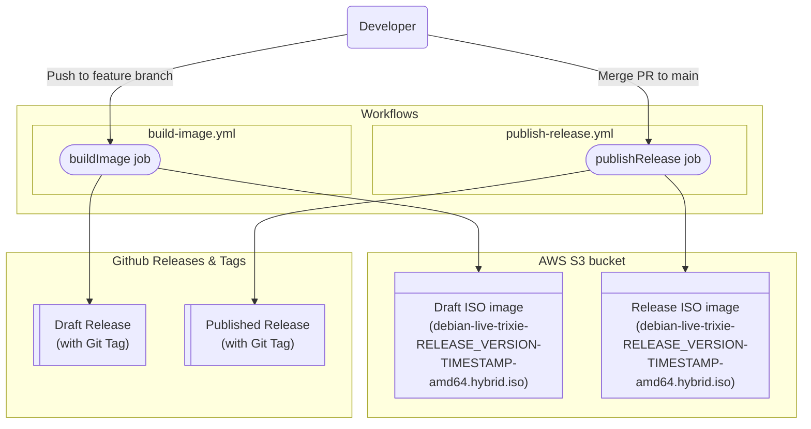

# GitHub Actions Workflows Documentation

This directory contains GitHub Actions workflows for CI/CD automation of the `IKSDP Linux Desktop` project. The workflows provide image building and release management.

## TOC
- [GitHub Actions Workflows Documentation](#github-actions-workflows-documentation)
  - [TOC](#toc)
  - [Overview](#overview)
  - [Workflow Details](#workflow-details)
    - [Build Image Workflow](#build-image-workflow)
      - [Jobs and Steps](#jobs-and-steps)
    - [Publish Release Workflow](#publish-release-workflow)
      - [Jobs and Steps](#jobs-and-steps-1)
  - [Workflow vizualization](#workflow-vizualization)
  - [Release Process](#release-process)
  - [Dependencies](#dependencies)

## Overview

The project uses two main workflows that work together to automate releases:

| | |
| :--- | :--- |
| [Build Image workflow](#build-image-workflow) | builds draft images on feature branches |
| [Publish Release workflow](#publish-release-workflow) | Builds images and publishes releases when merged to main |

## Workflow Details

### Build Image Workflow

| | |
| :--- | :--- |
| **File** | [`build-image.yml`](./build-image.yml) |
| **Trigger** | Push to any branch except `main`, excluding `.github` and `docs` paths |
| **Purpose** | builds draft container image and ensures version consistency |

#### Jobs and Steps
- **checkFileChanges:**
  - Checks out code with full history (fetch-depth: 0)
  - checks if changes in the codebase require a rebuild of the image
- **buildImageDraftRelease**
  - runs if the result of the  `checkFileChanges` step is `true`  
  - `prepare environment` prepares the environment for building the image
  - `remove not required folders from the build system` removes unnecessary folders from the build system
  - `Fetch build system infos` if enabled it fetches necessary information about the build environment
  - `installPrerequisites` installs necessary dependencies for building the image
  - `config Debian Live image` configures the Debian Live image with necessary settings using `lb config`
  - `build Debian Live image` runs the actual build process using `lb build`
  - `generate Bill of materials` runs trivy to generate the BOM (Bill of Materials)
  - `generate md5sum of iso`  generates the MD5 sum for the generated ISO image
  - `upload iso` uploads the generated ISO image to the configured url
  - `create release` creates or updates a draft release on GitHub with generated artifacts

### Publish Release Workflow

| | |
| :--- | :--- |
| **File** | [`publish-release.yaml`](./publish-release.yml) |
| **Trigger** | Push to `main` branch, excluding `.github` and `docs` paths |
| **Purpose** | Builds the release ISO image, publishes the Github release and creates a git tag |

#### Jobs and Steps
- **buildImageRelease**
  - `prepare environment` prepares the environment for building the image
  - `remove not required folders from the build system` removes unnecessary folders from the build system
  - `Fetch build system infos` if enabled it fetches necessary information about the build environment
  - `installPrerequisites` installs necessary dependencies for building the image
  - `config Debian Live image` configures the Debian Live image with necessary settings using `lb config`
  - `build Debian Live image` runs the actual build process using `lb build`
  - `generate Bill of materials` runs trivy to generate the BOM (Bill of Materials)
  - `generate md5sum of iso`  generates the MD5 sum for the generated ISO image
  - `upload iso` uploads the generated ISO image to the configured url
  - `create release` updates a draft release on GitHub with generated artifacts and publishes it

## Workflow vizualization

## Release Process

The complete release process follows this flow:

1. **Development:**
   - Work on feature branches
   - All pushes to non-main branches trigger the [Build Image workflow](#build-image-workflow)
   - This workflow builds a draft ISO image
   - The version is extracted from CHANGELOG.md and validated
   - Creates or updates a GitHub release with the changelog (including a git tag)

2. **PR Review:**
   - Create a pull request to merge changes into `main`
   - Review and approve the pull request

3. **Merge & Release:**
   - Merge the approved changes to the `main` branch
   - This triggers the [Publish Release workflow](#publish-release-workflow) which:
   - Builds and pushes the release ISO image
   - Updates a GitHub release with the changelog (including a git tag)

## Dependencies

- **Actions Used:**
  - `actions/checkout@v6.0.2` - Code checkout
  - `ncipollo/release-action@v1.20.0` - GitHub release creation

- **External Tools:**
  - [mdq](https://github.com/yshavit/mdq) Markdown query tool for changelog processing
  - [trivy](https://github.com/aquasecurity/trivy) for the BOM generation
  - [yq](https://github.com/mikefarah/yq) for YAML and JSON parsing
  - `RUNNER_PACKAGES` from the [build.env](../../debian-live/build.env) installed from the official Ubuntu repository
