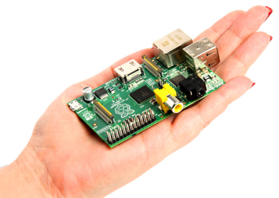
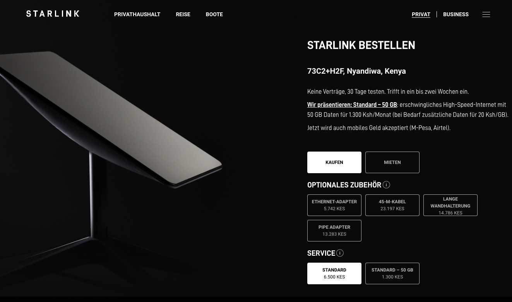
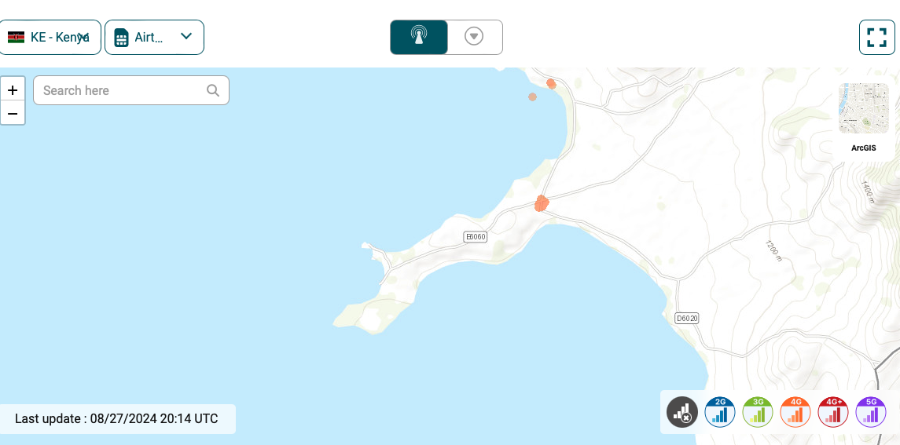
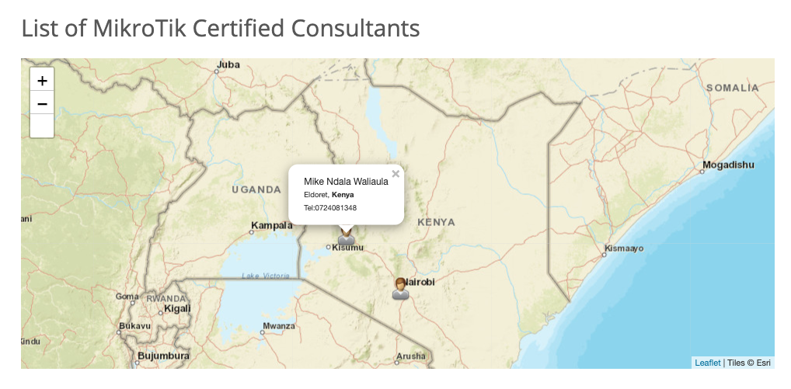

\newpage

## Ziel des Dokumentes

Dieses Dokument soll der Arbeitsgruppe des IKSDP als Grundlage dienen, um mögliche Verbesserungen der technischen Ausstattung des IKSDP zu erörtern. Es soll Orientierung hinsichtlich der Optionen und der damit verbundenen Kosten bieten.

Die PCs im Computerkabinett sollten durch zeitgemäße Geräte ersetzt werden, um den Nutzern einen sicheren Betrieb zu gewährleisten. Die anzuschaffende PC-Hardware sollte die folgenden Anforderungen erfüllen:

- Erstellung von Office-Dokumenten
- Internetnutzung (Browser)
- E-Mail-Kommunikation
- Wiedergabe von Videos in Full-HD
- Videotelefonie und -konferenzen über Zoom, Teams, Jitsi etc.

Es wird von einer vollständigen Neuanschaffung der Geräte ausgegangen. Sollten Möglichkeiten bestehen, Hardware als Spende zu erhalten, ist diese Option hinsichtlich Stromverbrauch und Leistungsfähigkeit zu bewerten.

## IST Situation

Bei meinem letzten Besuch im Jahr 2016 verfügte das IKSDP über ein kleines Computerkabinett mit 6 PCs, die etwa aus dem Jahr 2004 stammten. Auf diesen PCs war Windows XP mit einigen Office-Anwendungen installiert. Zudem gab es im Administrationsbüro einen Arbeits-PC. Alle PCs waren mit dem Internet verbunden. Der Support für Windows XP wurde von Microsoft am 8. April 2014 eingestellt. Seitdem gibt es keine Sicherheitsupdates oder Fehlerbehebungen mehr. Ob auf den PCs mit Windows XP Sicherheitsanwendungen installiert waren, ist unklar. Allerdings könnten diese aufgrund des fehlenden Supports von Microsoft nicht mehr ordnungsgemäß funktionieren. Laut Andreas Siekmann hat sich an dieser Situation bis heute nichts geändert. Es wird dringend davon abgeraten, diese PCs weiterhin in irgendeiner Weise weiter zu betreiben.

## Rückblick

Während unseres Besuchs wurden wir von mehreren Studenten und Bewohnern gefragt, ob wir PC-Hardware beschaffen könnten. Angesichts der damaligen Situation entwickelten wir die Idee, die veralteten PCs durch Raspberry Pis (Rasipi) zu ersetzen. Der Raspberry Pi ist ein Einplatinencomputer und einer der meistverkauften Computer weltweit. Er erfreut sich vor allem bei Hobbyisten, Bildungseinrichtungen und Entwicklern großer Beliebtheit.

Besonders der geringe Stromverbrauch von nur 4 Watt macht das Gerät vielseitig einsetzbar.

Unsere Idee war es damals, den Studenten und angehenden Lehrern zu zeigen, wie man verhältnismäßig preisgünstige Hardware (ca. 35 USD) beschaffen kann, um Projekte umzusetzen. Raspberry Pis sind auch in Kenia erhältlich. Voraussetzung war, dass der Raspberry Pi mit einem Linux-Betriebssystem läuft, da es für die ARM-Hardwareplattform, auf der der Raspberry Pi basiert, kein Windows gab.

Bei unseren Tests stellten wir fest, dass ein Betrieb eines Office-Arbeitsplatzes auf einem Raspberry Pi 3 grundsätzlich möglich ist, jedoch aufgrund des geringen Arbeitsspeichers (1 GB RAM) schnell an Grenzen stößt. Der Rechner wurde sehr langsam, sobald ein Internetbrowser parallel zu einem E-Mail-Programm oder einer Office-Anwendung geöffnet war.

Im Juni 2019 wurde der Nachfolger, der Raspberry Pi 4, veröffentlicht. Diese Version ist mit bis zu 8 GB RAM und einer deutlich leistungsfähigeren CPU erhältlich, allerdings auch zu einem höheren Preis (~100 USD). Unsere Tests im Jahr 2020 zeigten, dass mit diesem Gerät ein Office-Arbeitsplatz unter Linux gut betrieben werden kann. Allerdings sind Videotelefonate über Zoom oder Microsoft Teams mit Webcam nicht optimal möglich, da die Software von den Herstellern die Video-Hardwarebeschleunigung nicht unterstützte. Seit der Corona-Pandemie betrachten wir jedoch die Möglichkeit der Videotelefonie als zwingend erforderlich.

## PC Hardware

Im September 2023 wurde der Raspberry Pi 5 veröffentlicht, der über eine etwa viermal schnellere CPU verfügt. Es wurde jedoch noch nicht überprüft, ob diese Hardware nun für Videotelefonate ausreichend ist. Der Energieverbrauch stieg auf knapp 10 Watt. Der Preis für die 8-GB-Version liegt derzeit bei etwa 100 USD, zuzüglich Kosten für SD-Karte, Gehäuse und Netzteil, sodass sich der Gesamtpreis auf ungefähr 150 USD beläuft.

Anfang 2023 brachte Intel die N100-Plattform auf den Markt, die speziell für energieeffiziente Anwendungen wie Mini-PCs und kostengünstige Laptops entwickelt wurde. Im Gegensatz zum Raspberry Pi basiert diese Plattform auf der X86-Architektur und ist somit mit herkömmlichen PCs kompatibel. Dadurch wäre es möglich, ein “normales” Windows-Betriebssystem zu installieren, was die Kompatibilität erheblich verbessert.

### Intel N100 

Der Stromverbrauch der Intel N100-Plattform liegt bei etwa 8 Watt im Leerlauf (die meiste Zeit) und steigt auf bis zu 25 Watt unter Volllast (selten). Obwohl dieser Verbrauch höher ist als beim Raspberry Pi, ist er dennoch deutlich geringer als bei herkömmlichen Office-PCs, die etwa 50 Watt verbrauchen. Die N100-Plattform ist etwa 40 % schneller als ein Raspberry Pi 5 und sollte alle Anforderungen problemlos erfüllen können. Der N100 verfügt über 4 CPU-Kerne mit einer Taktfrequenz von bis zu 3,4 GHz.

Verschiedene Hersteller integrieren diese Plattform in ihre Geräte. Hier einige Beispiele:

**Aoostar T box n100**

Hardware: CPU: N100, RAM 8/16GB, 256GB SSD
CPUMark: 5500
Link: https://aoostar.com/products/aoostar-t-box-intel-n100-metal-case-mini-pc4c-4t-with-w11-home-8-16gb-ram-256-512gb-ssd

Preis: 137 EUR.

{ width=300px } 
``{=html}

**Bosgame mini pc**

Hardware: CPU: N100, RAM 16GB, 512GB SSD
CPUMark: 5500
Link: https://www.bosgamepc.com/products/bosgame-mini-pc-b100-intel-12th-gen-alder-lake--n100-16gb-ddr4-ram-512gb-ssd

Preis: 152 EUR

### AMD Lucienne

Der Mitbewerber AMD bietet mit den Lucienne-CPUs ein Konkurrenzprodukt zum Intel N100 an. Diese Prozessoren sind mit 8 Kernen ausgestattet und erreichen Taktraten von bis zu 4,3 GHz, was sie deutlich leistungsstärker macht. Zudem verfügen sie über einen integrierten Grafikchip, der ausreichend Leistung für einfache Spiele bietet. Allerdings sind diese CPUs auch teurer und haben einen etwas höheren Stromverbrauch. Ein Beispiel für ein Produkt mit dieser CPU ist:

**Aoostar MN57**

Hardware: CPU: AMD Ryzen 7 5700U, RAM 16GB, 256 SSD
CPUMark: 15000
Link: https://www.bosgamepc.com/products/bosgame-mini-pc-b100-intel-12th-gen-alder-lake--n100-16gb-ddr4-ram-512gb-ssd

Preis: 279 EUR

Alle Produkte stammen von chinesischen Anbietern, die direkt aus China versenden. Bei Aoostar ist eine Lieferung nach Kenia ohne zusätzliche Versandkosten auswählbar. Es sollte jedoch geprüft werden, welche Zollgebühren in Kenia anfallen könnten. Zudem ist zu klären, ob eine Bestellbestätigung von einem Onlineshop für den Projektsponsor ausreichend ist.

### Bildschirme

Unsere Internetrecherche hat ergeben, dass TFT-Monitore in Kenia tendenziell teurer und seltener erhältlich sind.

Hier Beispiele:

https://www.mombasacomputers.com/product/dell-p2018h-20-led-backlit-lcd-1600x900-hd-monitor/
Preis: 18000KES - 126 EUR + VAT

https://devicestech.co.ke/product/22inch-edge-to-edge-monitorex-uk/
Preis: 14500KES - 100 EUR + VAT

Env. könnte ein Kontakt in Nairobi die Preise für Bildschirme in einer Mall vor Ort überprüfen, da diese Geräte wahrscheinlich am besten direkt vor Ort zu beschaffen sind. Es könnte auch sinnvoll sein, die Geräte online zu kaufen und sie bei einer vertrauenswürdigen Person in Nairobi zu lagern.

### Auswertung und Kosten

Aktuell empfehlen wir einen Mini-PC auf Basis des Intel N100. Dieser bietet ausreichend Leistung, um die Anforderungen des IKSDP zu erfüllen, und stellt einen guten Kompromiss zwischen Kosten und Leistung dar.

Für die Hardware eines PC-Arbeitsplatzes sollte man mit etwa 250-300 USD rechnen. Zusätzlich zum PC sollten einfache USB-Headsets angeschafft werden, um Audio wiedergeben und aufzeichnen zu können. Außerdem müssen neue Tastaturen und Mäuse mit USB-Anschluss beschafft werden. Für einige der PCs sollten auch Webcams (ca. 50 USD) eingeplant werden.

| **Komponente** |  **Preis**   |
|------------|----------|
| PC N100    |  170 EUR |
| TFT        |  120 EUR |
| Zubehör    |  30  EUR |
|------------|----------|
| Summe      |  320 EUR |

## Internet

Wir konnten nicht feststellen, ob es Internetanbieter gibt, die an diesem Standort Internet über Telefon- oder Datenkabel anbieten können.

Daher haben wir uns auf mobile Lösungen konzentriert.

### Starlink

Starlink ist ein Satelliteninternetdienst von SpaceX, der globale Internetkonnektivität bietet, insbesondere für abgelegene oder unterversorgte Gebiete. Mithilfe eines Netzwerks von Tausenden von Satelliten in niedriger Erdumlaufbahn ermöglicht Starlink eine schnelle und zuverlässige Internetverbindung mit geringen Latenzzeiten. Das Produkt richtet sich sowohl an Privatpersonen als auch an Unternehmen und ist besonders nützlich in Regionen, in denen herkömmliche Internetinfrastrukturen schwer zugänglich sind.

In Deutschland bietet Starlink eine Leistung, die mit VDSL-Anschlüssen von 200 MBit/s vergleichbar ist. Erfahrungsberichte aus Kenia liegen uns derzeit noch nicht vor.

Seit Anfang 2024 ist der Internetzugang über Starlink laut Webseite auch in Nyandiwa verfügbar.

Die benötigte Hardware kann entweder gekauft oder gemietet werden. Die monatliche Miete beträgt 1950 KES (14 EUR), und die einmalige Aktivierungsgebühr liegt bei 2700 KES (18 EUR).

Entscheidet man sich für den Kauf statt der Miete, fallen 45.500 KES (322 EUR) für die Satellitenschüssel, 5700 KES für den Ethernet-Adapter und 13.300 KES für eine Halterung an.

Für den Internettarif kann man zwischen einem volumenbasierten Tarif (50 GB für 1300 KES/9 EUR) und einer Flatrate für 6500 KES (46 EUR) wählen. Überschreitet man beim volumenbasierten Tarif das Datenvolumen von 50 GB, werden 20 KES pro zusätzlichem GB berechnet. Ab einem monatlichen Datenverbrauch von 250 GB würde sich daher die Flatrate lohnen.

### Mobiles Internet

Es war sehr schwierig valide Abdeckungsdaten für den Standort in Nyandiwa zu bekommen. Laut https://nperf.com ist mobiles Inetnet lediglich über den Provider Airtel Mobile zu bekommen. Die Zelle endet aber direkt in Nyandiwa. Ist ist fragwürdig ob das IKSDP tatsächlich Empfang hat. 

| **Bundle** | **Preis (KES)**	 |
| -------|---------------|
| 5G Unlimited 10Mbps Plan |	3500KES/25 EUR |
| 5G Unlimited 20Mbps Plan |	5000KES/36 EUR |
| 5G Unlimited 30Mbps Plan |	6500KES/35 EUR |

Zusätzlich fallen Kosten für ein 5G/4G-Modem an. Ein 4G-Modem mit speziell verbesserter Reichweite, wie das Mikrotik LHG LTE18 Kit (siehe https://mikrotik.com/product/lhg_lte18), ist für etwa 250 EUR erhältlich. 5G-Hardware, die in naher Zukunft möglicherweise nicht vollständig genutzt werden könnte, kostet etwa 550 EUR.

### Auswertung und Kosten

Derzeit empfehlen wir einen Internetzugang über Starlink, da die Qualität des mobilen Internets schwer vorhersehbar ist. Wir würden die kleinere Variante mit gemieteter Hardware und einem 50-GB-Tarif vorschlagen. Falls sich herausstellt, dass mehr Daten benötigt werden, sollte auf den Flatrate-Tarif umgestellt werden.

Monatliche Kosten (Miete):

| **Komponete**                     | **Preis**             |
| ------------------------------| ------------------|
| Starlink Hardware             | 1950 KES (14 EUR) |
| Starlink Internettarif (50GB) | 1300 KES (9 EUR)  |
| optional 50GB*                | 1000 KES (7 EUR)  |
| ------------------------------| ------------------|
| Summe                         | 4250 KES (30 EUR) |

+ einmalige aktivierungsgebühr 2700 KES

## Netzwerk (WLAN)

Wir empfehlen als Hardware den europäischen Netzwerkausrüster Mikrotik mit Sitz in Riga, Lettland. Obwohl Mikrotik in Europa relativ unbekannt ist, erfreut sich das Unternehmen in Südamerika, Osteuropa, Asien und Afrika großer Beliebtheit. Mikrotik zeichnet sich durch einen extrem umfangreichen Funktionsumfang in Hard- und Software aus, der sonst oft nur in Unternehmenslösungen von Herstellern wie Cisco zu finden ist. Dabei sind die Hardwarekosten im Vergleich sehr gering. Ein weiterer Vorteil: Mikrotik hat bisher noch kein Gerät aus der Wartung genommen. Selbst Geräte, die 1997 hergestellt wurden, erhalten noch ein aktuelles Router-Betriebssystem.

Die Hardware kann in Kenia erworben werden, und es gibt sowohl Partner als auch Berater vor Ort, die im Notfall Unterstützung leisten können.

Für die Vernetzung der Rechner könnten wir die folgenden Produkte einsetzen:

https://mikrotik.com/product/hex_s 80EUR
https://mikrotik.com/product/l009uigs_2haxd_in 	120EUR

Diese Geräte sind auch geeignet um einen Fernzugriff zur Unterstützung aufzubauen. 

Um das Gelände mit WLAN zu versorgen, wären Outdoor-Access Points wie der Mikrotik mANTBox ax 15s https://mikrotik.com/product/mantbox_ax_15s  (ca. 180 EUR) geeignet. Das Gerät deckt einen Winkel von etwa 180 Grad ab. Je nach Positionierung könnten möglicherweise zwei Geräte erforderlich sein, um eine vollständige Abdeckung zu gewährleisten.

| **Komponete**                     | **Preis**             |
| ------------------------------| ------------------|
| Mikrotik HexS                 | 80 EUR            |
| L009UiGS-2HaxD-IN             | 120 EUR           |
| Access Point mANTBox ax 15s   | 180 EUR (env.2)   |
| Zubehör (Kabel, Netzteil)     | 50 EUR            |
| ------------------------------| ------------------|
| Summe                         | 430 EUR / 610 EUR |